# C4 niveau 2 — les conteneurs

**Étape** : E45 · **Blocs servis** : 2, critères 2.2 (diagrammes C4 niveaux 1
et 2), 2.6 (conteneurisation et orchestration) et 2.9 (documentation
d'architecture accessible) · **Amont** : [`c4-contexte.md`](c4-contexte.md) ·
**Complément** : [diagramme du pipeline](../03-pipeline/diagramme-pipeline.md)

Un « conteneur » au sens C4 est une **unité déployable ou un magasin de
données** : un processus qui tourne, un fichier que l'on lit. Ce n'est pas
forcément un conteneur Docker, même si ici la plupart en sont.

> **Vérifié avant d'être dessiné.** Chaque boîte ci-dessous correspond à un
> fichier ou un service que j'ai ouvert dans le dépôt le 2026-09-15. Ce qui est
> prévu et non construit porte `(prévu)` dans son libellé et un contour
> pointillé — les deux, pour que la distinction ne dépende ni de la couleur ni
> du rendu.

---

## Le diagramme

```mermaid
flowchart TB
    CONSEILLER["<b>Conseiller d'orientation</b><br/><i>[Personne]</i>"]
    EXPLOITANT["<b>Exploitant</b><br/><i>[Personne]</i>"]
    SOURCES["<b>5 producteurs publics</b><br/><i>[Systèmes externes]</i><br/>MESR, INSEE, ONISEP,<br/>France Compétences, France Travail"]

    subgraph SYS["EduMatch-IA"]
        direction TB

        subgraph SERVICE["Service en ligne"]
            direction TB
            ECRAN["<b>Écran conseiller</b><br/><i>[HTML, CSS, JavaScript sans cadriciel]</i><br/>Voir, comprendre, écarter avec motif.<br/>Servi en fichiers statiques par l'API,<br/>sous la racine."]
            API["<b>Service de matching</b><br/><i>[Conteneur : FastAPI / Uvicorn, image python:3.11-slim]</i><br/>/matching, /explain, /feedback,<br/>/assistant, /health.<br/>Charge ses artefacts au démarrage,<br/>n'entraîne jamais."]
        end

        subgraph LOT["Traitements par lots"]
            direction TB
            AIRFLOW["<b>Orchestrateur</b><br/><i>[Conteneur : Airflow 2.9.3, mode standalone]</i><br/>4 DAG, une cadence par source.<br/>La reprise est décidée en Python,<br/>pas par le retry natif."]
            TRAITEMENT["<b>Chaîne de traitement</b><br/><i>[Paquet Python : edumatch]</i><br/>Ingestion, qualité (Pandera),<br/>dbt + DuckDB, agrégat Sirene,<br/>variables, label."]
            ENTRAINEMENT["<b>Entraînement</b><br/><i>[Conteneur : image d'entraînement]</i><br/>LightGBM pondéré, SHAP, équité,<br/>ablation, dérive. Exécution unique,<br/>se termine en code 0."]
        end

        subgraph STOCKAGE["Magasins de données"]
            direction TB
            RAW[("<b>data/raw — bronze</b><br/><i>[Fichiers CSV, ZIP, Parquet]</i><br/>Immuable, jamais versionné,<br/>un manifeste par fichier")]
            SILVER[("<b>data/interim — silver</b><br/><i>[Fichier DuckDB]</i><br/>8 millésimes réconciliés")]
            GOLD[("<b>data/processed — gold</b><br/><i>[Parquet]</i><br/>Étoile, variables, précalcul SHAP,<br/>agrégats de débouchés")]
            JOURNAUX[("<b>Journaux de service</b><br/><i>[JSON Lines]</i><br/>Journal d'inférence (article 12)<br/>et retours du conseiller")]
        end

        subgraph SUIVI["Suivi d'expériences"]
            direction TB
            MLFLOW["<b>Registre d'expériences</b><br/><i>[Conteneur : MLflow 2.14.1]</i><br/>Paramètres, métriques, artefacts,<br/>empreinte du commit"]
            PG[("<b>Base du registre</b><br/><i>[Conteneur : PostgreSQL 16]</i><br/>Métadonnées MLflow uniquement")]
        end
    end

    subgraph CIBLE["Industrialisation — prévu, non construit"]
        direction TB
        CICD["<b>Chaîne CI/CD (prévu)</b><br/><i>[Dépôt distinct : edumatch-cicd]</i><br/>Lint, tests, construction d'images,<br/>déploiement"]
        IAC["<b>Infrastructure (prévu)</b><br/><i>[Terraform + Kubernetes managé]</i><br/>Requêtes, limites, autoscaling"]
        OBS["<b>Observabilité (prévu)</b><br/><i>[Prometheus + Grafana]</i><br/>Latence, erreurs, alertes"]
    end

    CONSEILLER -->|"HTTPS"| ECRAN
    ECRAN -->|"JSON / HTTP"| API
    EXPLOITANT -->|"déclenche, surveille<br/>[HTTP, port 8080]"| AIRFLOW
    EXPLOITANT -->|"compare les exécutions<br/>[HTTP, port 5000]"| MLFLOW

    AIRFLOW -->|"appelle les tâches<br/>en processus Python"| TRAITEMENT
    TRAITEMENT -->|"télécharge<br/>[HTTPS]"| SOURCES
    SOURCES -.->|"fichiers bruts"| RAW
    TRAITEMENT -->|"écrit, écriture atomique"| RAW
    TRAITEMENT -->|"réconcilie<br/>[dbt sur DuckDB]"| SILVER
    SILVER -->|"modèles gold"| GOLD
    TRAITEMENT -->|"agrégats, variables"| GOLD

    ENTRAINEMENT -->|"lit la table de variables"| GOLD
    ENTRAINEMENT -->|"enregistre paramètres,<br/>métriques et artefacts"| MLFLOW
    ENTRAINEMENT -->|"écrit prédictions<br/>et précalcul SHAP"| GOLD
    MLFLOW -->|"SQL"| PG

    API -->|"lit en lecture seule"| GOLD
    API -->|"ajoute une ligne<br/>par inférence et par retour"| JOURNAUX
    AIRFLOW -->|"purge par paliers"| JOURNAUX

    CICD -.->|"construira et déploiera"| API
    IAC -.->|"hébergera"| SYS
    OBS -.->|"observera"| API

    classDef personne fill:#f4f4f4,stroke:#333,color:#111
    classDef conteneur fill:#438dd5,stroke:#2e6295,color:#fff
    classDef magasin fill:#2a7f62,stroke:#1d5a45,color:#fff
    classDef externe fill:#8a8a8a,stroke:#5c5c5c,color:#fff
    classDef prevu fill:#ffffff,stroke:#8a8a8a,color:#333,stroke-dasharray: 6 4
    class CONSEILLER,EXPLOITANT personne
    class API,ECRAN,AIRFLOW,TRAITEMENT,ENTRAINEMENT,MLFLOW conteneur
    class RAW,SILVER,GOLD,JOURNAUX,PG magasin
    class SOURCES externe
    class CICD,IAC,OBS prevu
    style CIBLE fill:#fafafa,stroke:#bbbbbb,stroke-dasharray: 6 4
```

---

## Le tableau des conteneurs, avec leur état réel

| Conteneur | Technologie | Où il vit dans le dépôt | État au 2026-09-15 |
|---|---|---|---|
| Service de matching | FastAPI / Uvicorn, image `python:3.11-slim` | `src/edumatch/api/`, `docker/Dockerfile.serve` | Écrit et testé ; image décrite, exécution non root, sonde de vivacité |
| Écran conseiller | HTML, CSS, JavaScript natif | `src/edumatch/api/static/` | Écrit ; servi sous la racine de l'API |
| Orchestrateur | Airflow 2.9.3 (standalone) | `pipelines/edumatch_pipeline.py`, `docker/Dockerfile.airflow` | 4 DAG écrits ; logique métier testable hors Airflow |
| Chaîne de traitement | Polars, dbt, DuckDB, Pandera, PySpark | `src/edumatch/{ingestion,quality,transform,spark,features,referentiel}/` | Écrite, exécutée sur les données réelles |
| Entraînement | LightGBM, scikit-learn, SHAP, image `python:3.11-slim` | `src/edumatch/models/`, `docker/Dockerfile.train` | Écrit ; exécutions enregistrées ; image décrite, exécution non root |
| Registre d'expériences | MLflow 2.14.1 | `docker-compose.yml` (image officielle) | En service local |
| Base du registre | PostgreSQL 16 | `docker-compose.yml` (image officielle) | En service local |
| Magasins bronze / silver / gold | Fichiers : CSV, ZIP, DuckDB, Parquet | `data/` (jamais versionné, sauf `data/samples/`) | Peuplés |
| Journaux de service | JSON Lines | `data/processed/audit/`, retours du conseiller | Écrits par l'API, purgés par un DAG |
| **Chaîne CI/CD** | GitHub Actions, dépôt `edumatch-cicd` | — | **Prévu, non construit** |
| **Infrastructure** | Terraform, Kubernetes managé | — | **Prévu, non construit** |
| **Observabilité** | Prometheus, Grafana | — | **Prévu, non construit** |

Ce que ce tableau dit sans ambiguïté : **le système fonctionne aujourd'hui en
local, en conteneurs, et il n'est pas déployé.** Le fichier
`docker-compose.yml` décrit cinq services et leurs dépendances de démarrage ;
aucun registre de conteneurs distant ne reçoit d'image, aucune ressource cloud
n'existe. Je préfère l'écrire que le laisser deviner : un jury qui ouvre le
dépôt le constate en dix secondes, et l'écart entre le dossier et le dépôt est
exactement ce qui invalide un bloc.

---

## Les six décisions que ce diagramme matérialise

### 1. Aucun serveur de base de données pour l'entrepôt

PostgreSQL apparaît sur le diagramme, mais **uniquement comme base de
métadonnées de MLflow**. L'entrepôt en étoile, lui, est un fichier DuckDB pour
la couche silver et des fichiers Parquet pour la couche gold.

C'est un arbitrage de proportionnalité, pas une facilité. La couche gold pèse
quelques mébioctets pour 440 030 lignes de faits : y poser un serveur
relationnel, sa haute disponibilité et son exploitation coûterait une
complexité qu'aucun chiffre n'exige. DuckDB lit du Parquet en place, sans
serveur, sans processus à surveiller. Le seuil qui me ferait changer :
plusieurs lecteurs concurrents ayant besoin d'écrire, ou une couche gold
devenant trop grande pour un poste — ni l'un ni l'autre n'est le cas.

→ [ADR 0015](../adr/0015-modele-en-etoile-grain-et-scd2.md), et
[`modele-etoile.md`](modele-etoile.md) pour le grain et les dimensions.

### 2. Polars et Spark coexistent, et la configuration tranche à l'exécution

Le diagramme montre une seule « chaîne de traitement » parce qu'il n'y a qu'un
paquet Python — mais l'agrégat Sirene y existe en deux moteurs, qui partagent
un module unique de définitions (grain, colonnes, règles). Le commutateur est
`execution.moteur_volume` : `local` exécute Polars, `cluster` exécute Spark.

Pourquoi les deux ? Parce que la mesure et la trajectoire disent deux choses
différentes. Sur le stock des établissements — 43 896 818 lignes, 54 colonnes,
réduites à 9 colonnes projetées — Polars met 18,2 s là où Spark en met 87,0 s
pour un résultat identique : la machine virtuelle Java et le brassage entre
exécuteurs locaux coûtent plus qu'ils ne rapportent tant que le calcul tient
sur un nœud. Mais le fichier historique des établissements, déjà retenu comme
source, compte à lui seul 95 865 102 lignes, et le stock est republié chaque
mois. Écrire Spark maintenant, c'est garder la porte de sortie ouverte et la
prouver testée plutôt que promise.

→ [ADR 0016](../adr/0016-polars-en-execution-courante-spark-branche-en-mode-cluster.md),
[ADR 0002](../adr/0002-pas-de-databricks.md) pour le refus de Databricks.

### 3. L'API ne s'entraîne jamais, et cette dépendance est explicite

Le service de matching lit des artefacts précalculés : le catalogue de
prédictions et le précalcul SHAP par cellule. Il ne charge pas LightGBM pour
inférer à la volée, et il ne recalcule pas les valeurs de Shapley par requête.

La raison est un budget de latence : une explication SHAP calculée en ligne
coûte un temps sans rapport avec l'objectif de service que je me suis fixé
(p95 à 300 ms, valeur posée dans `configs/base.yaml` — un objectif, que je ne
présente pas comme une mesure en production tant qu'aucune production n'existe).
Précalculer déplace le coût du service vers le lot, où il est absorbable.

La contrepartie est assumée : le service ne sait expliquer que des cellules
déjà calculées. Le montage le rend visible plutôt que fragile — le service
d'entraînement doit s'être **terminé avec succès** avant que l'API démarre
(`service_completed_successfully` dans `docker-compose.yml`), et non
simplement avoir démarré.

### 4. La reprise est décidée en Python, pas par le mécanisme natif

Les tâches Airflow sont déclarées avec `retries=0`. Ce n'est pas un oubli :
c'est le code du projet qui décide de retenter, à partir d'un vocabulaire
d'erreur explicite — transitoire contre définitive. Un retry natif retenterait
aveuglément n'importe quelle exception, y compris un schéma cassé ou un
contrôle qualité en échec, c'est-à-dire précisément les cas où retenter ne
répare rien et masque la panne. La temporisation croissante (60 s puis 120 s,
trois tentatives au total) est en configuration, pas dans le code.

→ [ADR 0006](../adr/0006-vocabulaire-commun-erreur-transitoire-definitive.md).

### 5. Toute la configuration passe par un seul point d'entrée typé

Aucun chemin, aucun seuil, aucune URL de fichier n'est écrit dans le code : un
fichier `configs/base.yaml` commun, surchargé par environnement, chargé et
validé par `src/edumatch/config.py`. Les secrets ne passent que par
l'environnement. C'est ce qui rend vraie la phrase « la même chaîne s'exécute
en local et ailleurs » : seule la couche de configuration change.

→ [ADR 0003](../adr/0003-configuration-centralisee.md).

### 6. Les journaux de service sont un conteneur à part entière

Le journal d'inférence n'est pas un fichier de trace technique : c'est
l'obligation de journalisation du règlement sur l'IA (article 12), et sa durée
de conservation est bornée par paliers — pseudonymisation à 12 mois, agrégation
à 36 mois. C'est un DAG dédié qui applique la purge, et une commande permet de
la simuler avant de l'appliquer. Un magasin de données soumis à une obligation
de destruction mérite sa boîte sur le diagramme ; le noyer dans « les fichiers
de l'API » aurait fait disparaître la contrainte.

---

## Les flux, avec leur protocole et leur sens

| Flux | Protocole | Sens | Cadence |
|---|---|---|---|
| Conseiller → écran → service | HTTPS puis JSON/HTTP | Requête / réponse | À la demande |
| Chaîne de traitement → producteurs publics | HTTPS | Lecture seule | Annuelle, mensuelle, quotidienne selon la source |
| Chaîne → bronze → silver → gold | Système de fichiers | Écriture atomique, sens unique | Par exécution de DAG |
| Entraînement → registre d'expériences | HTTP (port 5000) | Écriture de métriques et d'artefacts | Par entraînement |
| Registre → base du registre | SQL / TCP (port 5432) | Lecture-écriture | Continue |
| Service → gold | Système de fichiers, **lecture seule** | Lecture | Au démarrage |
| Service → journaux | Système de fichiers, ajout en fin de fichier | Écriture | Par requête |
| Orchestrateur → journaux | Système de fichiers | Réécriture par purge | Quotidienne |

Le montage local monte la couche gold **en lecture seule** dans le service.
Ce n'est pas décoratif : c'est le moindre privilège appliqué au seul conteneur
exposé au réseau. S'il était compromis, il ne pourrait pas corrompre les
données qui alimentent le modèle.

---

## Ce que je n'ai pas dessiné, et pourquoi

- **Le niveau 3 (composants) pour tous les conteneurs.** Le modèle C4 le
  réserve aux endroits réellement complexes. Ici, le seul qui le mériterait est
  la chaîne de traitement, et son détail existe déjà sous une autre forme, plus
  utile : le [diagramme du pipeline](../03-pipeline/diagramme-pipeline.md) et
  le lignage généré par dbt.
- **Une topologie cloud.** Il n'y en a pas encore. Dessiner des sous-réseaux et
  des groupes de sécurité qui n'existent pas serait exactement l'erreur que ces
  diagrammes doivent éviter.
- **Le détail des quatre DAG.** Il est dans le diagramme du pipeline, à sa
  place.

---
*Étape E45 · état vérifié le 2026-09-15 : `docker-compose.yml` (5 services),
`docker/` (3 fichiers de construction d'image), `pipelines/` (4 DAG), absence
de `.github/workflows`, absence de code d'infrastructure, absence de
configuration d'observabilité.*
