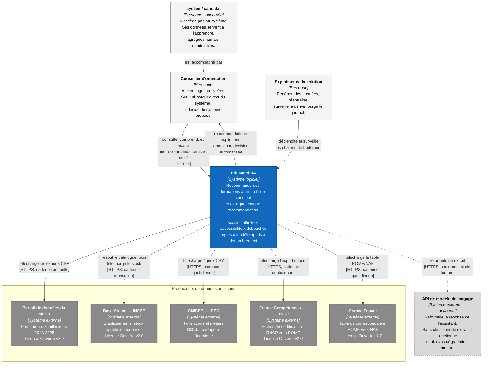

# C4 niveau 1 — le contexte

**Étape** : E45 · **Blocs servis** : 2, critères 2.2 (diagrammes C4 niveaux 1
et 2) et 2.9 (documentation d'architecture accessible) · **Suite** :
[`c4-conteneurs.md`](c4-conteneurs.md)

Ce document répond à une seule question : **à quoi sert EduMatch-IA, pour qui,
et de quoi dépend-il ?** Il se lit sans connaître le projet. L'intérieur du
système est au niveau 2 ; il n'apparaît pas ici, volontairement.

> **La règle que je me suis imposée sur ces diagrammes** : ils décrivent le
> dépôt tel qu'il est aujourd'hui, pas une cible. Tout élément non construit
> porte la mention `(prévu)` dans son libellé — pas seulement une couleur, pour
> qu'un lecteur en noir et blanc ne s'y trompe pas. J'ai vérifié chaque brique
> dans le dépôt avant de la dessiner.

---

## Le diagramme

---

## Ce que le diagramme dit, et qu'il faut lire explicitement

### Le conseiller est le seul utilisateur, et c'est une décision de conformité

Le candidat n'a pas d'accès. Ce n'est pas un manque de temps : le système
produit un profilage qui porte sur des mineurs, et le règlement européen sur
l'IA impose un contrôle humain effectif (article 14) sur un usage que son
annexe III classe à haut risque — l'accès à l'éducation. Interposer un
professionnel qui peut **écarter une recommandation en motivant son écart**
est ce qui rend ce contrôle réel plutôt que déclaratif : le motif est
enregistré, il devient une trace vérifiable.

Conséquence assumée : aucune décision n'est prise par le système. Il classe et
il explique. L'article 22 du RGPD, qui encadre la décision entièrement
automatisée, n'est donc pas la base du dispositif — c'est le sens du « le
système propose » inscrit dans la boîte du conseiller.

### Cinq producteurs, pas quatre

Le projet a longtemps été présenté avec quatre sources. Il en compte cinq
aujourd'hui : **France Travail** s'est ajouté en construisant la chaîne
NAF ↔ ROME ↔ formation, parce qu'il porte la seule table publique reliant
directement un code ROME à la nomenclature NAF (ADR 0017). Le diagramme dit
cinq, parce que le dépôt en ingère cinq — un connecteur par producteur dans
`src/edumatch/ingestion/`.

### Deux régimes de licence, qui ne se confondent pas

Quatre sources sont sous Licence Ouverte v2.0. **IDÉO est sous ODbL**, qui
impose le partage à l'identique de toute base dérivée redistribuée, et une
attribution portant le producteur et la date de la donnée réutilisée. C'est la
raison pour laquelle l'assistant documentaire rattache une citation à **chaque
ligne** indexée, et non au fichier entier. La distinction est portée jusque
dans la configuration : un champ `licence` par jeu dans `configs/base.yaml`.

### Le modèle de langage est optionnel, et son absence est visible

L'assistant documentaire répond en mode extractif : recherche par similarité
sur le corpus IDÉO, restitution des passages avec leurs sources. Une clé d'API
activerait en plus une reformulation, contrainte par une instruction qui lui
interdit d'ajouter quoi que ce soit hors des extraits fournis. Sans clé, le
client de génération vaut `None` et le mode extractif s'exécute seul. Le trait
pointillé du diagramme dit exactement cela : une dépendance réelle mais
facultative, dont l'absence est un comportement documenté et testé, pas un
plantage ni un silence.

### Les cadences ne sont pas les mêmes, et l'architecture en tient compte

Parcoursup publie une campagne par an, Sirene republie son stock chaque mois,
les référentiels sont republiés chaque jour. Le système n'a donc pas une
horloge mais quatre — le détail est dans le [diagramme du
pipeline](../03-pipeline/diagramme-pipeline.md).

---

## Les décisions que ce diagramme matérialise

| Ce que le diagramme montre | Décision correspondante |
|---|---|
| Le système télécharge d'abord, transforme ensuite | [ADR 0001](../adr/0001-elt-plutot-que-etl.md) — ELT plutôt qu'ETL |
| Aucune URL de fichier Sirene en configuration, seulement un identifiant de jeu | [ADR 0005](../adr/0005-resolution-dynamique-url-sirene.md) — résolution dynamique par le catalogue |
| Un export RNCP par date de publication, jamais un fichier écrasé | [ADR 0007](../adr/0007-datation-quotidienne-export-rncp.md) |
| Cinq producteurs, dont France Travail | [ADR 0017](../adr/0017-chaine-naf-rome-formation-trois-sources-manque-parcoursup-declare.md) |
| Un seul composant appris sur les trois termes du score | Détaillé au [niveau 2](c4-conteneurs.md) |

---

## Ce que ce niveau ne montre pas, volontairement

- **L'intérieur du système** : c'est l'objet du niveau 2.
- **L'hébergement** : aucune infrastructure cloud n'est déployée à ce jour. Le
  système s'exécute en conteneurs sur un poste. L'écrire ici reviendrait à
  dessiner une cible ; le niveau 2 le dit sans détour, à sa place.
- **Les rôles de gouvernance** (responsable de traitement, délégué à la
  protection des données) : ils relèvent du plan de gouvernance, pas d'un
  diagramme de contexte logiciel.

---
*Étape E45 · vérifié le 2026-09-15 contre l'état du dépôt : cinq connecteurs
d'ingestion présents dans `src/edumatch/ingestion/`, licences relevées dans
`configs/base.yaml`.*
