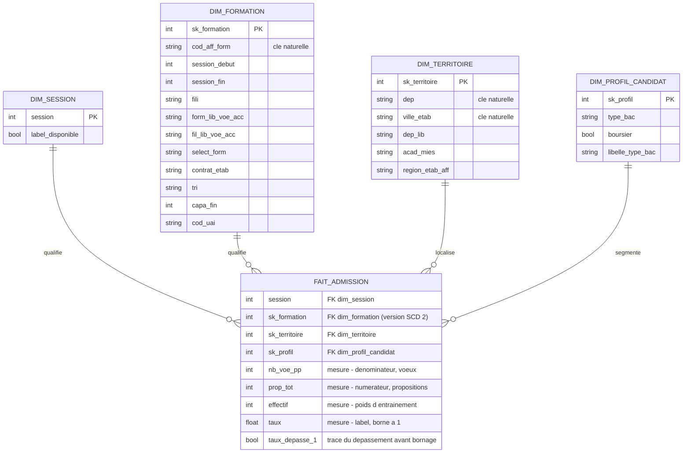

# Le modèle en étoile de la couche gold

**Étape** : E16 · **Bloc servi** : 2, critère 2.1 (modélisation logique et
physique : modèle en étoile justifié) · **Code** :
`src/edumatch/transform/etoile.py`, `src/edumatch/transform/run_etoile.py`,
`src/edumatch/transform/dbt/models/gold/` · **Décision** : ADR 0015

Ce document expose le modèle dimensionnel de la couche gold : sa forme logique,
son grain, sa réalisation physique, et la façon de le reproduire et de consulter
son lignage. Les arbitrages qui l'ont produit — et les options écartées — sont
dans l'ADR 0015 ; je ne les répète pas ici, j'y renvoie.

---

## Le grain, avant tout le reste

C'est la première décision d'un modèle dimensionnel, et la plus structurante :
un grain flou rend faux tous les agrégats construits au-dessus.

> **Une ligne de `fait_admission` est une cellule dont le taux d'admission est
> calculable : un croisement `(session, formation, type de baccalauréat, statut
> de boursier)`.**

Une ligne silver — une formation pour une session — se déplie donc en jusqu'à
six lignes de faits, une par profil de candidat. Elle n'en produit aucune si son
taux n'est calculable pour aucun profil : c'est ce qui écarte les sessions 2018
et 2019, sans qu'aucun millésime ne soit nommé dans le code (ADR 0012,
ADR 0015 décision 6).

Une fois les dimensions résolues, le grain s'écrit `(session, sk_formation,
sk_profil)`. Il est **vérifié unique** sur les 440 030 lignes produites — à la
construction, puis à nouveau par un test dbt singulier.

## Le schéma logique



Une étoile, pas un flocon : `dim_territoire` porte académie et région en clair
plutôt que de les renvoyer vers des sous-dimensions. La redondance est assumée,
c'est le principe (ADR 0015, décision 2).

## Les cinq tables, une par une

| Table | Grain — une ligne = … | Clé | SCD | Lignes | Colonnes |
|---|---|---|---|---:|---:|
| `fait_admission` | une cellule dont le taux est calculable | `(session, sk_formation, sk_profil)` | — | **440 030** | 9 |
| `dim_formation` | une **version** d'une formation | `sk_formation` (naturelle : `cod_aff_form`) | **type 2** | 43 858 | 12 |
| `dim_territoire` | un couple département × ville d'établissement | `sk_territoire` (naturelle : `dep`, `ville_etab`) | type 1 | 1 448 | 6 |
| `dim_profil_candidat` | une combinaison type de bac × boursier | `sk_profil` (naturelle : `type_bac`, `boursier`) | fixe | 6 | 4 |
| `dim_session` | un millésime Parcoursup ingéré | `session` | — | 8 | 2 |

### `fait_admission`

Quatre clés de dimension, cinq mesures. Répartition par session :

| Session | Cellules |
|---|---:|
| 2020 | 67 768 |
| 2021 | 71 080 |
| 2022 | 72 784 |
| 2023 | 74 831 |
| 2024 | 76 408 |
| 2025 | 77 159 |
| **Total** | **440 030** |

Le label `taux` vaut `prop_tot / nb_voe_pp`, borné à 1 conformément à l'ADR 0009 ;
**0 ligne ne porte un taux hors de `[0, 1]`**, vérifié sur l'artefact produit.
`taux_depasse_1` conserve en clair l'information du dépassement avant bornage :
elle n'est pas perdue, elle est rendue explicite. `effectif` reprend `nb_voe_pp`
et sert de poids à l'entraînement.

Le label est calculé **ici et une seule fois**. Le répéter dans chaque étape aval
aurait garanti qu'un jour deux versions de la formule divergent silencieusement.

### `dim_formation` — la seule dimension historisée

43 858 versions pour 16 618 formations distinctes, soit 2,6 versions par
formation en moyenne et 6 au maximum (une par session observée). Une version
naît dès que l'un des huit attributs suivis change : `fili`, `form_lib_voe_acc`,
`fil_lib_voe_acc`, `select_form`, `contrat_etab`, `tri`, `capa_fin`, `cod_uai`.
La plage de validité est bornée par `session_debut` et `session_fin`.

**Un écart de périmètre à ne pas confondre.** Le catalogue silver compte
16 960 formations distinctes sur 2020-2025, dont 10 826 présentes aux six
sessions. `dim_formation` n'en porte que **16 618** : les 342 autres figurent
au catalogue mais n'ont aucune cellule dont le label soit calculable, et
n'entrent donc dans aucune ligne de faits. Les deux chiffres sont justes ;
ils ne comptent pas la même chose, et les commentaires du code précisent
désormais lequel s'applique.

C'est ce qui permet de reconstituer l'état d'une formation **tel qu'il était à
la session observée**, et donc d'éviter qu'une valeur de 2025 ne soit attribuée
à une cellule de 2020 — une fuite rétrospective (ADR 0015, décision 3).

`cod_uai` identifie l'établissement gérant. C'est un attribut de dimension pour
l'analyse et la supervision, **jamais une variable du modèle** (ADR 0011,
ADR 0013). Aucune dimension « établissement » séparée n'a été créée : la raison
est dans l'ADR 0015, décision 4.

### `dim_session` — et le sort de 2018 et 2019

| session | label_disponible |
|---|---|
| 2018 | non |
| 2019 | non |
| 2020 à 2025 | oui |

Les huit millésimes ingérés figurent dans la dimension. Deux n'apparaissent
jamais dans les faits : sur silver, `nb_voe_pp_bg` est renseigné pour 2018 et
2019 (10 697 et 11 577 lignes), mais `prop_tot_bg` ne l'est sur **aucune ligne**.
Le numérateur du label n'existe pas, aucune cellule n'est calculable.
`label_disponible` porte cette information dans le schéma, plutôt que de laisser
un lecteur se demander où sont passées deux des huit sessions.

### `dim_profil_candidat` — six lignes qui ne viennent d'aucune colonne

Les six combinaisons `(bg, bt, bp) × (boursier, non boursier)`. Elles ne sont
pas extraites d'une colonne du fichier source : elles sont portées par la
**structure** du label, qui vit dans les suffixes des couples
`nb_voe_pp_* / prop_tot_*`. C'est la seule dimension sans amont dans le graphe
de lignage, et c'est exact : elle ne dépend d'aucune donnée.

---

## La modélisation physique

### Où vivent les fichiers

| Couche | Emplacement | Format |
|---|---|---|
| bronze | `data/raw/parcoursup/` | CSV publiés, immuables |
| silver | `data/interim/parcoursup/silver.parquet` | Parquet, 104 274 lignes × 128 colonnes |
| **gold** | `data/processed/parcoursup/*.parquet` | **Parquet, un fichier par table** |
| base de travail dbt | `data/interim/parcoursup/silver.duckdb` | DuckDB, régénérable |

### Taille sur disque — relevée sur les artefacts réels

| Fichier | Octets | Ordre de grandeur |
|---|---:|---|
| `fait_admission.parquet` | 4 037 104 | 3,85 Mio |
| `dim_formation.parquet` | 694 034 | 678 Kio |
| `dim_territoire.parquet` | 31 344 | 30,6 Kio |
| `dim_profil_candidat.parquet` | 2 765 | 2,7 Kio |
| `dim_session.parquet` | 1 706 | 1,7 Kio |
| **Couche gold complète** | **4 766 953** | **4,55 Mio** |

Pour comparaison, sur la même machine : `silver.parquet` pèse 16 247 456 octets
(15,5 Mio) et la base de travail `silver.duckdb` 22 294 528 octets (21,3 Mio).

**C'est ce chiffre de 4,55 Mio qui justifie tout le reste du dimensionnement.**
Une couche gold de cette taille ne demande ni serveur d'entrepôt, ni moteur
distribué, ni partitionnement. Elle se lit en entier en mémoire sur n'importe
quel poste. Le seuil de bascule vers un entrepôt distant est écrit dans
l'ADR 0015, décision 5 : quelques dizaines de gigaoctets de travail, un accès
concurrent multi-services, ou un besoin de mise à jour transactionnelle. Aucun
n'est atteint.

### Moteur et format

- **Parquet** comme format d'échange : typage conservé, lecture par colonne,
  compression Snappy. C'est le format par défaut dès qu'un fichier est relu par
  un programme — et gold est relue par la construction des variables, par
  l'entraînement et par l'audit d'équité.
- **DuckDB** comme moteur pour dbt : lit et écrit le Parquet nativement, aucun
  serveur à administrer, base de travail régénérable. Le profil de connexion est
  local au dépôt et son chemin vient d'une variable d'environnement calculée
  depuis la configuration, jamais d'un chemin en dur.

### Typage

Les clés de substitution sont des entiers nullables (`Int64`), `taux` un
flottant, `taux_depasse_1` un booléen. Le typage de la couche silver, dont gold
hérite, est déterminé par une règle générique — une colonne devient numérique
seulement si elle se convertit **sans perte** sur les huit millésimes — et non
par une table de correspondance à maintenir à la main. C'est ce qui garantit,
entre autres, que `dep` reste du texte : `2A` et `2B` existent.

### Écriture

Chacune des cinq tables est écrite par fichier temporaire renommé à la fin —
jamais de fichier gold tronqué qu'une reprise après coupure prendrait pour
complet. La même primitive sert à l'ingestion et à la couche silver.

### Ce qui est versionné, et ce qui ne l'est pas

| Versionné | Non versionné |
|---|---|
| le code de construction (`etoile.py`, `run_etoile.py`) | `data/raw/`, `data/interim/`, `data/processed/` |
| les modèles dbt et leur `schema.yml` | `silver.duckdb` et les artefacts de compilation dbt (`target/`) |
| le test de grain singulier | les fichiers Parquet gold eux-mêmes |
| les échantillons de `data/samples/` | |

Aucun artefact de données n'entre dans le dépôt : ils se régénèrent tous depuis
`data/raw/`, qui est la seule couche immuable.

---

## Comment reproduire

```bash
# Chemin de production : silver -> gold, sans dépendance à dbt
make gold

# Rejeu par dbt : matérialise silver ET gold dans DuckDB,
# exécute les tests, puis génère le graphe de lignage
make transform-lignage
```

`make gold` exécute `python -m edumatch.transform.run_etoile`. Il exige que
`data/interim/parcoursup/silver.parquet` existe — sinon il s'arrête avec un
message qui indique de lancer `make transform` d'abord, plutôt que d'échouer
obscurément plus loin. Il journalise les volumétries obtenues, à confronter aux
chiffres de ce document.

`make transform-lignage` exécute `dbt run`, `dbt test` puis `dbt docs generate`.
Dernière exécution vérifiée : **26 nœuds, 26 succès** — modèles et tests, dont
le test singulier de grain sur `fait_admission`. Le catalogue est produit sur les
**6 nœuds** du projet : `stg_parcoursup` et les cinq tables gold.

La suite de tests complète du dépôt (`make test`) compte **260 tests,
260 succès**.

Les deux chemins appellent **les mêmes fonctions**. Ce qui change entre eux
n'est jamais le calcul, seulement le moteur qui a chargé la table amont : un
`dbt.ref()` d'un côté, une lecture Parquet directe de l'autre. Les modèles dbt de
`gold/` ne contiennent aucune logique — ils existent pour que le graphe de
dépendances soit produit automatiquement, pas pour réécrire en SQL ce qui est
déjà écrit et testé en Python.

## Consulter le lignage

```bash
make transform-lignage
cd src/edumatch/transform/dbt
python -m dbt.cli.main docs serve --project-dir . --profiles-dir .
```

Le graphe montre la chaîne complète : source bronze → `stg_parcoursup` →
les trois dimensions issues de silver → `fait_admission`, seul modèle qui dépend
à la fois de silver et de ses trois dimensions. Cet ordre n'est pas déclaré à la
main : il est déduit des `ref()`, et c'est exactement l'ordre que respecte le
chemin de production. `dim_profil_candidat` apparaît sans amont — c'est un
constat exact, pas un oubli de dépendance (voir plus haut).

## Ce que le modèle garantit, et comment

| Propriété | Comment elle est garantie |
|---|---|
| Grain unique | Vérifié à la construction (erreur levée sinon) **et** rejoué par le test dbt `assert_grain_unique_fait_admission` |
| Aucun fait orphelin | Une clé de dimension non résolue lève une erreur avant l'écriture |
| Aucune dimension orpheline | Faits et dimensions sont construits sur le **même** sous-ensemble exploitable |
| Aucune jointure qui gonfle | Chaque jointure de dimension compare le nombre de lignes avant et après, et lève si elles diffèrent — la signature d'une plage de validité SCD 2 qui se recouvre |
| Taux dans `[0, 1]` | Bornage à la construction (ADR 0009), 0 ligne hors bornes sur l'artefact |
| Écriture non tronquée | Fichier temporaire renommé à la fin |

Le contrôle de jointure mérite un mot : un simple test « pas de doublon sur le
grain final » ne l'aurait pas remplacé. Si une dimension proposait deux versions
candidates pour une même clé naturelle, les lignes fabriquées en trop porteraient
par construction des clés de substitution **différentes** — le grain final
resterait unique, et le défaut passerait inaperçu. Il fallait donc contrôler la
jointure elle-même, pas seulement son résultat.

## Limites assumées

- **`session_fin` documente la dernière session observée, pas une garantie de
  continuité.** Si une formation n'a aucune cellule exploitable une année donnée,
  cette session n'est pas interpolée dans sa plage de validité. Une lecture qui
  supposerait la continuité se tromperait.
- **`dim_formation` est construite formation par formation en Python**, pas en
  SQL ensembliste. À 16 618 formations c'est négligeable ; à un ordre de grandeur
  de plus, il faudrait la réécrire en fonction de fenêtre.
- **La couche gold ne couvre que Parcoursup.** Les agrégats territoriaux issus de
  Sirene ne sont pas encore une table de faits de cette étoile : ils viendront par
  le job d'agrégation dédié, et leur rattachement au territoire fera l'objet d'une
  décision distincte.
- **Aucun partitionnement, aucune indexation.** À 4,55 Mio, ce serait de la
  complexité gratuite. Le premier signe qu'il en faudrait serait une lecture
  sélective par session devenant coûteuse — elle ne l'est pas.
- **Deux sessions sur huit ne portent aucun fait.** Ce n'est pas une limite du
  modèle mais de la source, et le modèle la documente au lieu de la masquer.

---
*Étape E16 · décisions dans l'ADR 0015 · chiffres relevés le 2026-08-30 sur
`data/processed/parcoursup/`.*
