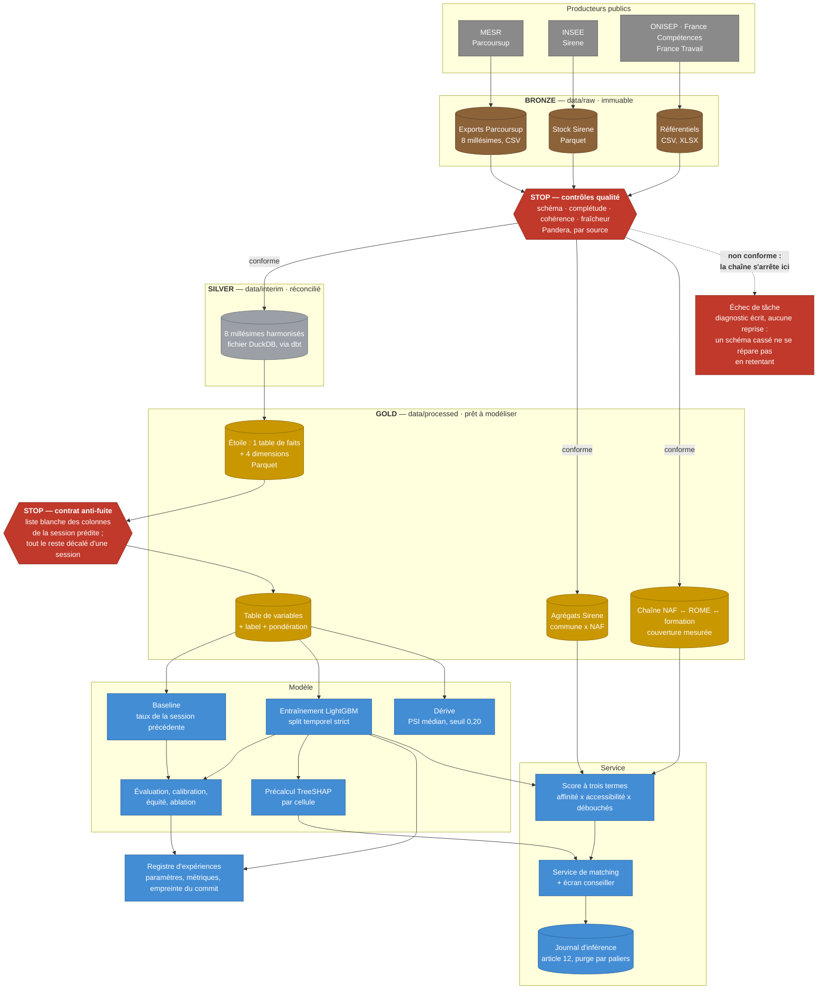
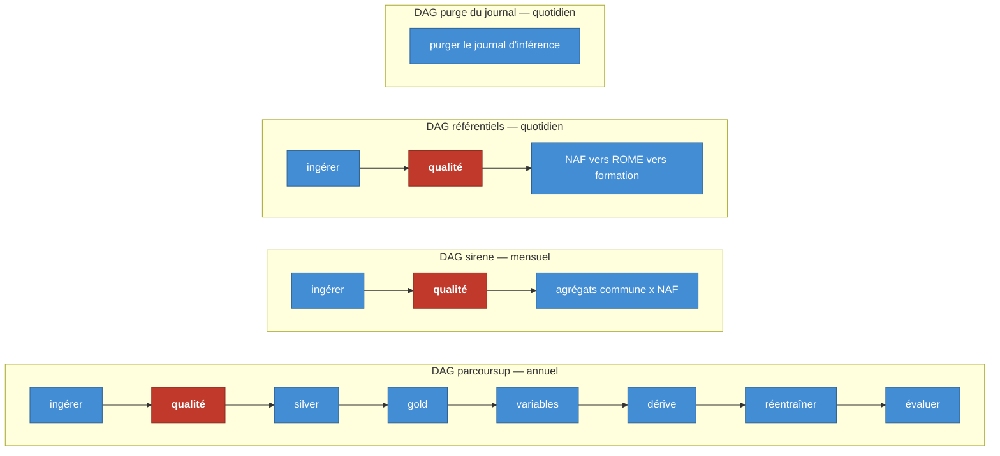

# Le diagramme du pipeline

**Étape** : E45 · **Blocs servis** : 3, critères 3.11 (diagramme du pipeline),
3.1 (système par lots adapté aux contraintes) et 3.5 (contrôle qualité :
détection, validation, blocage) · **Code** : `pipelines/edumatch_pipeline.py`,
`src/edumatch/orchestration/` · **Amont** :
[C4 niveau 2](../02-architecture/c4-conteneurs.md)

Ce document montre le chemin d'une donnée, de son producteur public jusqu'à
l'écran du conseiller, et l'endroit exact où la chaîne s'arrête si la donnée
n'est pas conforme. Les documents voisins détaillent chaque étape :
[ingestion](ingestion.md), [qualité](qualite.md),
[transformation](transformation.md), [agrégats Sirene](agregats-sirene.md),
[réconciliation NAF ↔ ROME](reconciliation-naf-rome.md).

---

## Vue d'ensemble : bronze, silver, gold, puis le modèle

Les points marqués **STOP** sont bloquants : la tâche échoue, et aucune
tâche placée après elle ne s'exécute.

---

## Quatre chaînes, quatre cadences — et pourquoi pas une seule

Le pipeline n'est pas un graphe unique, mais quatre graphes indépendants, un
par cadence réelle de publication.

Un DAG unique cadencé sur la source la plus fréquente aurait retéléchargé
Parcoursup et Sirene tous les jours. L'idempotence de l'ingestion l'aurait
absorbé sans rien casser (un fichier déjà présent et intact n'est pas
retéléchargé), mais la chaîne aurait rejoué les contrôles qualité et occupé
un créneau d'ordonnancement pour rien 29 jours sur 30 côté Sirene, 364 sur
365 côté Parcoursup. Aligner la cadence sur la publication réelle de la
source évite ce gaspillage.

Les cadences ne sont pas écrites dans le code, elles sont dans
`configs/base.yaml`, section `orchestration.planification`.

---

## Les trois propriétés que ce pipeline doit tenir

### Le blocage qualité, et pourquoi il est placé juste après l'ingestion

Les contrôles s'exécutent entre le brut et toute transformation, le seul
endroit où ils servent : plus loin, une donnée non conforme aurait déjà
contaminé les couches suivantes.

Un échec lève une erreur rangée du côté définitif. Deux conséquences
enchaînées : la reprise ne se déclenche pas (retenter un schéma cassé ne le
répare pas), et la règle de déclenchement par défaut d'Airflow, qui exige
que toutes les tâches amont aient réussi, empêche d'elle-même l'exécution de
tout ce qui suit. Le blocage est donc obtenu par un mécanisme natif, sans
code supplémentaire dans le graphe.

Ce point distingue un contrôle qui bloque d'un contrôle qui journalise : le
second laisse une donnée corrompue atteindre le modèle, et le problème se
découvre trois semaines plus tard dans une métrique inexplicable.

→ [ADR 0014](../adr/0014-pandera-plutot-que-great-expectations.md) pour le
choix de l'outil, [`qualite.md`](qualite.md) pour les quatre familles de
contrôle.

### Le contrat anti-fuite, entre gold et les variables

C'est le second point d'arrêt, et le plus discret. Construire une variable à
partir d'une colonne qui n'existe qu'après la décision que l'on prétend
prédire produit un modèle excellent en test et inutile en service : c'est la
fuite de données.

Le mécanisme est une liste blanche. Seules les colonnes explicitement
autorisées peuvent être lues sur la session prédite ; toutes les autres sont
décalées d'une session. Une colonne non déclarée fait échouer la
construction, au lieu d'entrer silencieusement dans la table. Un test dédié
le démontre plutôt que de l'affirmer.

→ [ADR 0010](../adr/0010-fuite-fonctionnelle-tension-et-decalage-temporel.md),
[ADR 0013](../adr/0013-decision-des-variables.md).

### L'idempotence et la reprise

Rejouer une tâche doit produire le même état, pas un doublon. L'ingestion
écrit un fichier temporaire qu'elle renomme à la fin : jamais de fichier
tronqué que la suite croirait complet. Un fichier déjà présent et conforme
à son manifeste n'est pas retéléchargé.

La reprise distingue deux natures d'échec : transitoire (coupure réseau,
quota momentané), que l'on retente avec une temporisation croissante (trois
tentatives, 60 s puis 120 s), et définitive (schéma changé, contrôle
qualité en échec), que l'on fait remonter immédiatement. Confondre les
deux, c'est soit marteler un service déjà saturé, soit masquer une panne
réelle derrière des reprises inutiles.

→ [ADR 0006](../adr/0006-vocabulaire-commun-erreur-transitoire-definitive.md),
[ADR 0004](../adr/0004-primitives-partagees-et-quarantaine-manifeste.md).

---

## Les décisions que ce diagramme matérialise

| Ce que le diagramme montre | Décision correspondante |
|---|---|
| Bronze conservé intact, transformations en aval | [ADR 0001](../adr/0001-elt-plutot-que-etl.md) — ELT |
| Silver en DuckDB, gold en étoile Parquet | [ADR 0015](../adr/0015-modele-en-etoile-grain-et-scd2.md) |
| Agrégats Sirene en un seul bloc, deux moteurs possibles | [ADR 0016](../adr/0016-polars-en-execution-courante-spark-branche-en-mode-cluster.md) |
| Définition et bornage du label | [ADR 0009](../adr/0009-definition-et-bornage-du-label.md) |
| Six sessions exploitables, pas huit | [ADR 0012](../adr/0012-revision-protocole-evaluation-et-conservation-2020.md) |
| Chaîne NAF ↔ ROME ↔ formation, et son manque déclaré | [ADR 0017](../adr/0017-chaine-naf-rome-formation-trois-sources-manque-parcoursup-declare.md) |
| Dérive : PSI médian, seuil de réentraînement | [ADR 0018](../adr/0018-detection-de-derive-seuil-et-agregation.md) |
| Aucune variable de genre en entrée, substituts surveillés | [ADR 0011](../adr/0011-substituts-du-genre-et-dispositif-a-trois-niveaux.md) |

---

## Les limites que ce diagramme ne masque pas

- **Deux millésimes sur huit ne produisent aucun fait.** Le numérateur
  ventilé par type de baccalauréat n'existe pas avant 2020 : le label n'est
  calculable que sur six sessions. C'est une limite de la source, pas du
  modèle, et la chaîne l'écarte par une règle générale plutôt qu'en nommant
  des années dans le code.
- **La chaîne NAF ↔ ROME ↔ formation ne rejoint pas Parcoursup par une
  clé.** Aucun millésime ne porte de code RNCP, NSF ou ROME. Le
  rapprochement se fait par appariement de libellés, et sa couverture est
  mesurée et déclarée plutôt que supposée, voir l'ADR 0017 et
  [`reconciliation-naf-rome.md`](reconciliation-naf-rome.md).
- **Le modèle n'a pas encore battu sa baseline.** Le diagramme montre les
  deux branches, entraînement et plancher, parce que la comparaison est
  rapportée telle qu'elle est mesurée.
- **La surveillance d'exécution reste locale.** La dérive est calculée et
  écrite ; aucune alerte n'est encore routée vers un système
  d'observabilité, prévu mais non construit. C'est dit de la même façon
  dans le [C4 niveau 2](../02-architecture/c4-conteneurs.md).

---
*Étape E45 · vérifié le 2026-09-16 contre `pipelines/edumatch_pipeline.py`
(4 DAG, dont un DAG annuel Parcoursup à huit tâches qui se termine par le
réentraînement et son évaluation), `src/edumatch/orchestration/taches.py`
(13 tâches) et `configs/base.yaml` (cadences et seuils).*
