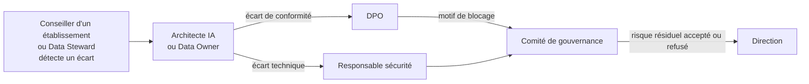
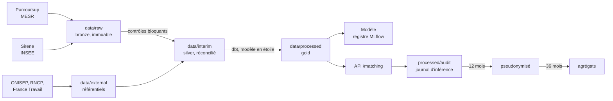
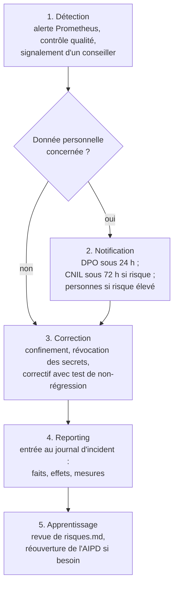

# Stratégie de gouvernance des données

**Critères servis** : Bloc 1, 1.1 (politiques), 1.2 (rôles), 1.5 (risques),
1.11 (audit et mise à jour) · **Version** : 1.1 · **Date** : 2026-09-17.

**Périmètre** : l'entreprise EduMatch et sa plateforme d'orientation.

EduMatch est une jeune entreprise EdTech d'Île-de-France, en phase
d'amorçage (levée seed de 350 000 euros). Elle édite une plateforme
d'orientation en B2B2C. Ses clients sont des établissements : lycées,
collèges, CFA, organismes de formation. Ses utilisateurs finaux sont des
élèves et des personnes en reconversion. En tant qu'architecte IA, je pilote
la gouvernance des données : ce document décrit celle que je conçois et
préconise pour l'entreprise.

`plan-gouvernance.md` dit **comment** la plateforme est gouvernée :
classification, règles d'usage, secrets, audit en douze points. Ce
document-ci dit **vers quoi** et **avec qui** : vision, organisation,
indicateurs, feuille de route. Il ne remplace aucun document du dossier.
Pour le détail, il renvoie à `plan-gouvernance.md`,
`registre-traitements.md`, `registre-sources.md`, `risques.md`, `aipd.md`,
`ai-act.md` et `model-card.md`.

Règle de lecture : chaque chiffre cité renvoie au fichier qui le porte.
Quand une valeur n'a jamais été mesurée, j'écris « non mesuré ».

---

## 1. Vision et piliers

**Vision.** Une recommandation d'orientation adressée à un lycéen doit pouvoir
être expliquée, contestée et retracée, et ne doit rien affirmer que les
données ne prouvent pas.

| Pilier | Ce qu'il engage | Preuves dans le dépôt |
|---|---|---|
| 1. Preuve avant déclaration | Un chiffre non reproductible est retiré | `plan-gouvernance.md` §1, `04-modele/evaluation.md` |
| 2. Minimisation par conception | Liste blanche : ce qui n'est pas classé n'entre pas | `configs/base.yaml` (`modele.variables`), `tests/data/test_variables_reference.py` |
| 3. Non-discrimination mesurée | Le genre sert l'audit, jamais le modèle | `tests/data/test_features_build_antifuite.py`, `04-modele/equite.md`, ADR 0011 |
| 4. Contrôle humain effectif | Le conseiller comprend et écarte avec motif | `src/edumatch/api/routes/feedback.py`, `06-service/ecran-conseiller.md` |
| 5. Traçabilité bornée dans le temps | Journaliser, puis pseudonymiser, puis agréger | `src/edumatch/api/audit.py`, `audit_purge.py`, `06-service/journalisation-purge.md` |

Ces piliers ne sont pas des valeurs affichées. Chacun a un test, un fichier
ou un motif de blocage qui le rend opposable.

---

## 2. Organisation

### 2.1 Les parties prenantes et leur rôle de gouvernance

Je rattache chaque rôle de gouvernance à une partie prenante existante
d'EduMatch. Le détail des périmètres de décision est dans
`plan-gouvernance.md` §3.

| Niveau | Rôle de gouvernance | Tenu chez EduMatch par | Responsabilité principale |
|---|---|---|---|
| Stratégique | Sponsor de la gouvernance | Direction (3 associés) | Arbitre valeur, coût et conformité ; accepte ou refuse les risques résiduels |
| Stratégique | Pilote de la gouvernance | Architecte IA | Conçoit l'architecture et la gouvernance, anime le comité, prépare les arbitrages |
| Stratégique | Délégué à la protection des données (DPO) | DPO | Qualification juridique, AIPD, licences, **droit de blocage** de la mise en production |
| Tactique | Data Owner, un par domaine | Un associé de la direction pour chaque domaine : catalogue de formations, territoire et emploi, référentiels | Usage autorisé, classification, durée de conservation |
| Tactique | Responsable du modèle | Architecte IA | Variables, protocole d'évaluation, seuils de dérive, Model Card |
| Tactique | Pilotage de la mise en œuvre | Cheffe de projet agile | Inscrit les actions de conformité au backlog, suit leurs échéances |
| Opérationnel | Data Steward | Équipe de développement (pipelines de données) | Qualité, schémas, contrôles bloquants, nomenclatures |
| Opérationnel | Responsable sécurité technique | Un membre désigné de l'équipe de développement | Secrets, accès, chiffrement, cloisonnement |
| Opérationnel | Référent accessibilité | Référent accessibilité | Conformité RGAA des écrans |
| Opérationnel | Superviseur humain (AI Act art. 14) | Conseillers d'orientation des établissements clients | Revoir, contextualiser, écarter une recommandation avec motif |

**Hors de l'entreprise.**

| Partie prenante | Place dans la gouvernance |
|---|---|
| Établissements clients | Déployeurs au sens de l'AI Act (art. 26) ; responsables de traitement pour l'exploitation (T4 à T7) |
| Élèves, personnes en reconversion | Personnes concernées : information, droits, contestation |
| Fournisseurs de données : MESR, INSEE, France Compétences, ONISEP | Titulaires des droits ; leurs licences fixent les conditions de réutilisation (`registre-sources.md`) |

### 2.2 Le partage fournisseur / déployeur

EduMatch édite la plateforme : elle est **fournisseur** au sens de l'AI Act
et porte les articles 9 à 15. L'établissement client est **déployeur** : il
utilise le système conformément à la notice, assure la supervision humaine
et informe les personnes. Côté RGPD, EduMatch est responsable de traitement
pour le développement (T1 à T3) et sous-traitant pour l'hébergement ;
l'établissement est responsable de traitement pour l'exploitation. Ce
partage est écrit dans `ai-act.md` §1.3 et `registre-traitements.md` §1.

Conséquence que je préconise : chaque contrat client annexe la notice
d'utilisation et désigne, côté établissement, les conseillers habilités à
superviser.

### 2.3 Les instances que je préconise

| Instance | Composition | Fréquence | Décide de |
|---|---|---|---|
| Comité de gouvernance des données d'EduMatch | Direction, architecte IA, DPO, cheffe de projet | Mensuelle pendant la campagne Parcoursup, trimestrielle sinon | Indicateurs du §4, revue de `risques.md`, levée des motifs de blocage |
| Revue annuelle | Comité, plus le responsable sécurité et le référent accessibilité | À la publication du millésime Parcoursup | Audit complet en douze points (`plan-gouvernance.md` §6) |
| Comité client | Architecte IA, DPO, référent de l'établissement déployeur | Deux fois par an | Retours des conseillers, taux d'écartement, demandes d'évolution |
| Cellule d'incident | DPO, responsable sécurité, Data Owner concerné | À l'événement | Qualification et notification (§8) |

**Escalade.**

Le droit de bloquer une mise en production appartient au DPO. La levée d'un
motif de blocage appartient au comité, sur preuve. Quand un motif porte sur
son domaine, le Data Owner concerné ne décide pas de sa levée ; l'avis écrit
du DPO figure au compte rendu du comité.

---

## 3. Architecture en zones et règles d'accès

J'emploie la convention de fichiers standard. La correspondance avec
l'architecture en médaillon est : `raw` = bronze, `interim` = silver,
`processed` = gold.

| Zone | Niveau de classification (`plan-gouvernance.md` §2) | Qui écrit | Qui lit |
|---|---|---|---|
| `data/raw/` | P (Parcoursup), P et DP pour Sirene | Connecteurs d'ingestion, exclusivement | Data Steward |
| `data/external/` | P | Connecteur référentiels | Data Steward, responsable du modèle |
| `data/interim/` | Niveau le plus élevé des sources | Transformations dbt | Data Steward |
| `data/processed/` | P, sauf agrégat Sirene (DP) | Transformations, calcul du label | Responsable du modèle, API |
| `data/processed/audit/` | DP+ puis DP | API, exclusivement | DPO, déployeur, autorité sur demande |
| `data/samples/` | DP (échantillon Sirene pseudonymisé) | Versionné, revue obligatoire | Suite de tests |

Règles transverses : `data/raw/` ne se modifie jamais ; aucune zone
`data/` n'est versionnée, sauf `samples/` ; une restitution territoriale
passe le seuil de k-anonymat avant de quitter la zone gold.

---

## 4. Tableau de bord de gouvernance

« Actuel » = dernière valeur mesurée et écrite dans le dépôt. Les
responsables sont des rôles du §2.1.

| Indicateur | Objectif | Seuil d'alerte | Actuel | Source | Responsable | Fréquence |
|---|---|---|---|---|---|---|
| Colonnes Parcoursup classées | 100 % | Une colonne non classée | 128 / 128 | `configs/base.yaml`, `tests/data/test_variables_reference.py` | Data Steward | À chaque millésime |
| Variables de genre en entrée | 0 | ≥ 1, blocage | 0 (4 colonnes classées `interdite`) | `tests/data/test_features_build_antifuite.py` | Responsable du modèle | À chaque entraînement |
| Ratio d'impact disparate, groupe le plus féminisé | ≥ 0,80 | < 0,80 | **0,76** (référence 0,63) | `04-modele/equite.md`, `configs/base.yaml` (`equite.seuil_impact_disparate`) | DPO + responsable du modèle | À chaque modèle |
| ECE (erreur de calibration), test 2025 | Sous la référence | Au-dessus de la référence | **0,0371** (référence 0,0322) | `04-modele/evaluation.md` | Responsable du modèle | À chaque modèle |
| MAE pondérée, test 2025 | Sous la référence | Au-dessus de la référence | **0,0758** (référence 0,0701) | `04-modele/evaluation.md` | Responsable du modèle | À chaque modèle |
| PSI médian des 46 variables | < 0,20 | ≥ 0,20, réentraînement | 0,0061 (validation), 0,0096 (test) | ADR 0018, `configs/base.yaml` (`derive`) | Responsable du modèle | À chaque millésime |
| Couverture du terme de débouchés | À fixer par le comité | — | 1,4 % des lignes (6 017 / 440 030) | `risques.md` R7 | Data Owner territoire et emploi | À chaque millésime |
| Latence p95 de `/matching` | < 300 ms | ≥ 300 ms (alerte `EdumatchLatenceP95Elevee`) | Non mesuré sous trafic réel | `edumatch-cicd/monitoring/slo.md` | Responsable sécurité technique | Continue |
| Disponibilité de `/matching` | ≥ 99,5 % hors 5xx | 5xx > 5 % sur 5 min | Non mesuré sous trafic réel | `edumatch-cicd/monitoring/slo.md` | Responsable sécurité technique | Continue |
| Seuil de k-anonymat des restitutions | k = 5 | Cellule restituée sous 5 | Appliqué | `configs/base.yaml` (`matching.k_anonymat_debouches`), `src/edumatch/matching/agregat_sirene_debouches.py` | DPO | À chaque restitution |
| Purges du journal exécutées | Une par jour planifiée | Un jour sans purge | Non mesuré en exploitation (planifiée `@daily`) | `pipelines/edumatch_pipeline.py`, `configs/base.yaml` | Data Steward | Quotidienne |
| Taux d'écartement des conseillers | > 0, à interpréter | Nul sur une campagne | Non mesuré (compteur instrumenté) | `src/edumatch/api/routes/feedback.py` | Établissement client (déployeur), avec l'architecte IA | Mensuelle |
| Incidents et violations RGPD | 0 | ≥ 1 | Non mesuré (aucun journal d'incident) | §8 | DPO | Continue |
| Secrets versionnés | 0 | ≥ 1, blocage | 0 | `.gitignore`, vérifié par `git check-ignore -v` | Responsable sécurité technique | À chaque commit |
| Motifs de blocage actifs | 0 avant mise en service | ≥ 1 | 5 (A à E) | `aipd.md` §8.4 | DPO | Mensuelle |

**Lecture.** Trois indicateurs sont en alerte, et je les laisse en alerte :
équité, calibration, précision. Ils fondent l'avis défavorable rendu sur la
restitution du terme appris à des candidats réels (`aipd.md` §8.3). Un taux
d'écartement nul n'est pas un succès : il signale une supervision de façade
(`risques.md` R6).

---

## 5. Correspondance avec le DAMA-DMBOK

Le DAMA-DMBOK (*Data Management Body of Knowledge*) découpe la gestion des
données en onze domaines. Je le prends comme grille de couverture, pas
comme méthode à dérouler.

| Domaine DMBOK | Couvert par | État |
|---|---|---|
| Gouvernance des données | `plan-gouvernance.md`, ce document | Couvert |
| Architecture des données | `02-architecture/`, diagrammes C4, ADR 0001 (ELT) | Couvert |
| Modélisation et conception | `02-architecture/modele-etoile.md`, ADR 0015 | Couvert |
| Stockage et opérations | Parquet par zone, ADR 0016, `edumatch-cicd/terraform/` | Couvert |
| Sécurité des données | `plan-gouvernance.md` §5, `src/edumatch/api/auth.py` | Partiel : compte conseiller partagé, chiffrement non démontré |
| Intégration et interopérabilité | `src/edumatch/ingestion/`, `03-pipeline/reconciliation-naf-rome.md` | Couvert, couverture NAF ↔ formation faible et déclarée |
| Métadonnées | Manifestes d'ingestion, `dbt docs` (`03-pipeline/transformation.md`) | Couvert, sans catalogue d'entreprise |
| Qualité des données | `src/edumatch/quality/`, ADR 0014, `tests/data/test_quality_run_blocage.py` | Couvert |
| Données de référence et maîtresses | `data/external/referentiels/`, `registre-sources.md` | Partiel : aucun référentiel maître de formations unifié |
| Entrepôt et décisionnel | Modèle en étoile en zone gold | Couvert pour le modèle, pas de décisionnel produit |
| Gestion documentaire et contenus | `src/edumatch/rag/`, brique secondaire | Partiel |

---

## 6. Méthodologie d'audit RGPD en cinq étapes

L'audit annuel suit `plan-gouvernance.md` §6. Voici son déroulé.

| Étape | Ce que je fais | Support | Sortie |
|---|---|---|---|
| 1. Préparation | Fixer le périmètre (T1 à T8), rassembler les manifestes et la dernière AIPD | `registre-traitements.md`, `aipd.md` | Périmètre daté |
| 2. Cartographie | Pour chaque traitement : données, base légale, durée, destinataires, flux hors UE | `registre-traitements.md` §2 et §3 | Tableau de synthèse à jour |
| 3. Analyse des écarts | Confronter chaque déclaration au code : purge existe-t-elle, test passe-t-il | Les douze points de `plan-gouvernance.md` §6 | Liste des écarts, avec preuve |
| 4. Droits des personnes | Vérifier que chaque droit s'exerce en moins d'un mois, jusqu'aux journaux et sauvegardes | `registre-traitements.md` T8 | Constat par droit |
| 5. Rapport et plan d'action | Classer les écarts, attribuer un rôle et une échéance | §7 ci-dessous | Entrée datée, points en échec |

Appliquée à la plateforme au 2026-09-17, l'étape 4 échoue entièrement : T8
n'est pas encore construit. L'étape 3 relève les cinq motifs du §7.

---

## 7. Plan de mise en conformité

Échéances relatives : aucune mise en service réelle n'est datée.

| # | Objectif | Action | Responsable | Échéance | Critère de levée |
|---|---|---|---|---|---|
| A | Supervision imputable | Remplacer le compte conseiller partagé par des comptes individuels | Responsable sécurité | Avant mise en service | Chaque écartement porte un identifiant individuel authentifié |
| B | Journal de supervision borné | Identifiant de corrélation T5/T6, extension de `audit_purge.py` | Data Steward | Avant mise en service | Purge T6 testée et planifiée |
| C | Information du candidat | Rédiger la notice, affichée avant la saisie, lisible à 17 ans | DPO | Avant mise en service | Notice visible sur l'écran avant tout champ |
| D | Estimation fiable | Réentraîner, tester sur une session non consultée | Responsable du modèle | Au prochain millésime Parcoursup | MAE < 0,0701 et ECE < 0,0322 (`aipd.md` §8.3) |
| E | Attribution des sources | Écran « Sources et licences » alimenté par les manifestes | Data Owner référentiels | Avant mise en service | Paternité et date affichées pour chaque source |
| T4 | Saisie non conservée, prouvée | Test qui vérifie qu'aucune saisie ne survit à la requête hors T5 | Data Steward | Avant mise en service | Test vert |
| T6 | Motif libre maîtrisé | Revue périodique des motifs saisis | DPO | Avant mise en service | Procédure écrite et exécutée une fois |
| T7 | Assistant encadré | Contrat de sous-traitance (art. 28) avec le fournisseur de modèle de langage | DPO | Avant activation de T7 | Contrat signé |
| T8 | Droits exerçables | Formulaire, registre des demandes, effacement jusqu'aux journaux | DPO | Avant mise en service | Demande test traitée en moins d'un mois |
| AI-1 | Journal d'incident (art. 9, 73) | Registre d'incident et procédure du §8 | DPO | Avant mise en service | Registre existant, exercice à blanc réalisé |
| AI-2 | Notice déployeur (art. 13) | Notice d'installation et de maintenance distincte de la Model Card | Responsable du modèle | Avant mise en service | Document remis au déployeur |
| AI-3 | Surveillance après commercialisation (art. 72) | Plan écrit, `models/derive.py` comme instrument | Responsable du modèle | Avant mise en service | Plan approuvé par le comité |
| AI-4 | Détection de secrets | Analyse de secrets dans les workflows d'intégration continue | Responsable sécurité | Avant mise en service | Étape bloquante dans `ci.yml` |

---

## 8. Procédure d'incident et de violation

Le RGPD impose de notifier la CNIL dans les **72 heures** après avoir pris
connaissance d'une violation présentant un risque (art. 33), et d'informer
les personnes si le risque est élevé (art. 34).

| Étape | Règle |
|---|---|
| Détection | Toute alerte est horodatée ; le délai de 72 heures court dès la prise de connaissance |
| Notification | En cas de doute sur le risque, je notifie : une notification inutile coûte moins qu'un retard |
| Correction | Un secret exposé est révoqué avant d'être remplacé (`plan-gouvernance.md` §5) |
| Reporting | Chaque violation est consignée, même non notifiée (art. 33.5) |
| Apprentissage | Un incident déclenche la mise à jour documentaire de `plan-gouvernance.md` §7 |

État : procédure écrite ici, **journal d'incident non construit** (action AI-1).

---

## 9. Feuille de route

### 9.1 Phases réalisées

Dates reprises de `avancement.md`.

| Phase | Objectif | Jalon | Livrables | Période |
|---|---|---|---|---|
| Fondations | Dépôt normé, secrets exclus | Deux dépôts publiés | Arborescence, `configs/`, `.gitignore` vérifié | 24 au 26 août 2026 |
| Données | Accès réel, licences vérifiées | Connecteurs idempotents | `src/edumatch/ingestion/`, `registre-sources.md` | 26 au 29 août |
| Exploration | Comprendre, repérer les substituts | Décision de variables | Notebooks, ADR 0011 et 0013 | 29 août |
| Qualité et transformation | Données validées, modèle en étoile | Contrôle bloquant démontré | `quality/`, `transform/dbt/`, label | 29 au 30 août |
| Modèle | Mesurer honnêtement | Comparaison à la référence rapportée | Évaluation, SHAP, équité, ablation | 30 au 31 août |
| Service | Recommander et superviser | Écran conseiller | API, journal, purge, écran, assistant | 1er septembre |
| Industrialisation | Automatiser et surveiller | Dérive mesurée, SLO déclaré | DAG, conteneurs, Terraform, monitoring | 1er au 16 septembre |
| Gouvernance | Rendre la conformité opposable | Avis de l'AIPD rendu | Registres, AIPD, Model Card, AI Act | 15 septembre |

Restent ouverts dans le plan d'exécution : CI/CD (en cours), panne provoquée
filmée, vidéos, relecture croisée dossier ↔ dépôt.

### 9.2 Phases à venir

| Phase | Objectif | Jalon de sortie | Condition |
|---|---|---|---|
| Conformité avant mise en service | Lever les motifs A à E et les actions du §7 | Zéro motif de blocage actif | Validation du comité, preuve par motif |
| Pilote chez un établissement client | Supervision réelle, restitution aux conseillers uniquement | Premier taux d'écartement mesuré | AIPD du déployeur, notice remise |
| Amélioration continue | Réentraîner et réauditer à chaque millésime | Audit annuel sans point en échec non traité | Nouveau millésime Parcoursup publié |

Le pilote ne restitue pas l'estimation apprise à des mineurs tant que le
motif D n'est pas levé.

---

## 10. Adoption et culture

Une gouvernance que personne n'applique est un document. Je préconise
qu'EduMatch forme trois publics.

| Public | Besoin | Réponse | Fondement |
|---|---|---|---|
| Conseillers d'orientation | Comprendre le score, ses limites, et oser l'écarter | Formation avant accès : lecture des facteurs SHAP, biais d'automatisation, écartement motivé, interdiction de consigner santé, famille ou origine | AI Act art. 4 (maîtrise de l'IA) et art. 14 |
| Candidats | Savoir ce qui est traité, pourquoi, et comment contester | Notice en français simple, affichée avant la saisie | RGPD art. 12 à 14, art. 8 |
| Équipe de développement | Appliquer les règles sans y penser | Tests bloquants, liste blanche, gabarit de commit | `plan-gouvernance.md` §4 |

Contenu minimal de la formation des conseillers : ce que le modèle ne sait
pas faire (`model-card.md`), pourquoi il sur-annonce sur les formations très
féminisées (`04-modele/equite.md`), comment écarter une recommandation.
Indicateur d'adoption : le taux d'écartement du §4.

État : formation et notice **non rédigées** (motif C, action AI-2).

---

## 11. Ce que ce document ne couvre pas, et ce que j'ai écarté

J'applique une règle de proportionnalité : un outil n'entre que s'il répond
à un besoin réel d'EduMatch. En amorçage, l'entreprise a une petite équipe
et un budget seed de 350 000 euros. Chaque licence et chaque outil à
administrer se paie sur ce budget.

| Écarté | Ce qu'il apporte | Pourquoi je ne le préconise pas aujourd'hui |
|---|---|---|
| SAFe (cadre agile à grande échelle) | Coordination de plusieurs équipes agiles | Une équipe de développement unique ; les sprints pilotés par la cheffe de projet suffisent |
| Jira | Suivi de tickets | Le backlog de la cheffe de projet, l'historique Git et `avancement.md` tracent déjà chaque action |
| Collibra (catalogue de données) | Catalogue et lignage d'entreprise | Le lignage est produit par `dbt docs`, le catalogue par la documentation versionnée et les manifestes |
| Power BI | Tableaux de bord métier | Pas de tableau de bord produit à ce stade ; Grafana couvre l'exploitation |
| Certification ISO/IEC 42001 | Système de management de l'IA | Coût disproportionné avant la mise sur le marché ; l'écart est déclaré dans `ai-act.md` §3 |

**Le seuil qui me ferait changer d'avis.**

| Signal de croissance | Ce que je réexaminerais |
|---|---|
| Plusieurs équipes de développement | Un cadre de coordination agile |
| Plus de dix sources, ou plus de trois Data Owners actifs | Un catalogue de données : il coûte alors moins que la documentation tenue à la main |
| Des dizaines d'établissements clients | Un outil de tickets partagé avec les clients, et un décisionnel pour le comité client |
| Mise sur le marché du système à haut risque | Un système de management de la qualité formalisé (AI Act art. 17) |

**Limites de ce document.**

- Les instances du §2.3 sont préconisées : aucun compte rendu de comité
  n'existe encore dans le dépôt.
- Plusieurs indicateurs sont « non mesurés » faute d'exploitation chez un
  établissement client.
- Les responsables du §7 sont des rôles, pas des personnes nommées.

---
*Version 1.1 du 2026-09-17. Revue par le comité de gouvernance, à chaque
audit annuel, en même temps que `plan-gouvernance.md`.*
